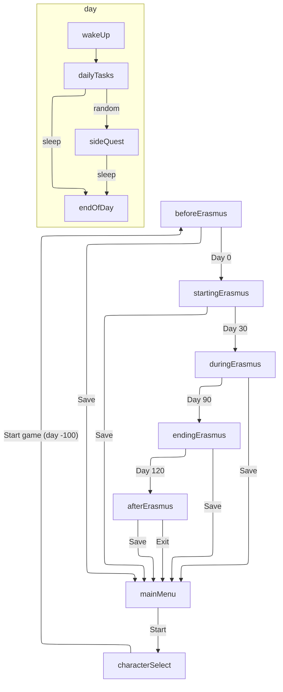

```mermaid
---
config:
  layout: elk
---
flowchart 
 subgraph day["day"]
        dailyTasks["dailyTasks"]
        wakeUp["wakeUp"]
        sideQuest["sideQuest"]
        endOfDay["endOfDay"]
  end
    mainMenu["mainMenu"] -- Start --> characterSelect["characterSelect"]
    characterSelect -- "Start game (day -100)" --> beforeErasmus["beforeErasmus"]
    beforeErasmus -- Day 0 --> startingErasmus["startingErasmus"]
    startingErasmus -- Day 30 --> duringErasmus["duringErasmus"]
    duringErasmus -- Day 90 --> endingErasmus["endingErasmus"]
    endingErasmus -- Day 120 --> afterErasmus["afterErasmus"]
    afterErasmus -- Exit --> mainMenu
    beforeErasmus -- Save --> mainMenu
    startingErasmus -- Save --> mainMenu
    duringErasmus -- Save --> mainMenu
    endingErasmus -- Save --> mainMenu
    afterErasmus -- Save --> mainMenu

    wakeUp --> dailyTasks
    dailyTasks -- random --> sideQuest
    sideQuest -- sleep --> endOfDay
    dailyTasks -- sleep --> endOfDay

```